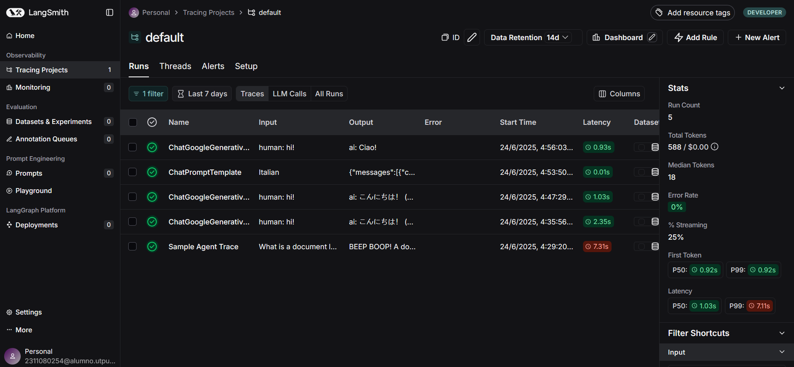
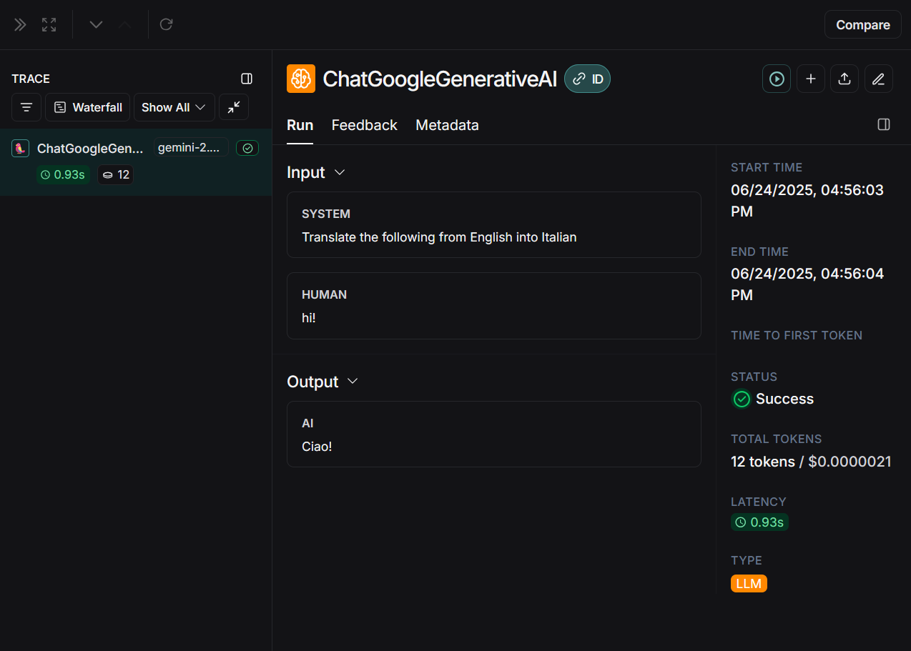
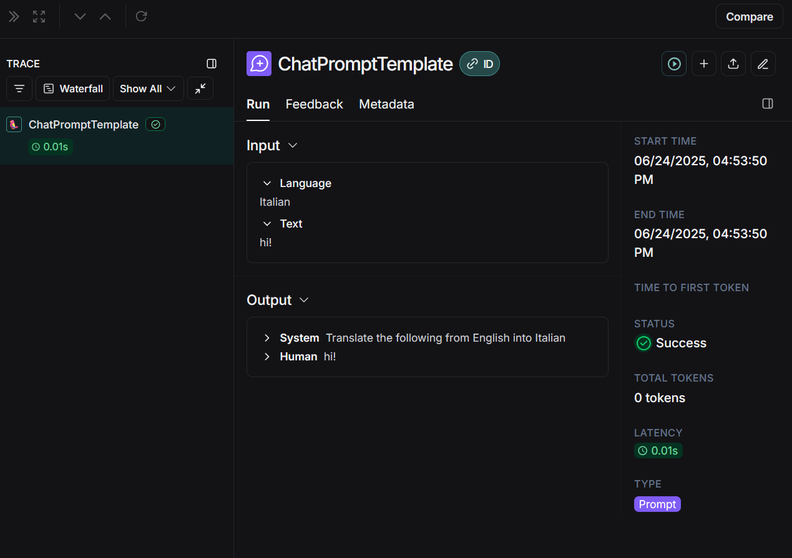

# LangChain Translation Applications

This repository contains three implementations of a translation service using LangChain and Google's Gemini model:

1. A web interface (deployed on GitHub Pages)
2. A simple command-line application (`main.py`)
3. An interactive Jupyter notebook (`LLM_application.ipynb`)

## Web Interface

You can access the web interface at: [https://[your-username].github.io/llm-nullsafe/](https://netfoor.github.io/Simple-LangChain-Translation-Application/)

Features:
- Simple and modern UI
- Support for multiple languages
- Secure API key handling (never stored, only kept in memory)
- Responsive design for mobile devices

### Web Interface Screenshots


*Main interface of the translation application*


*Example of a successful translation*

## LangSmith Integration

This project uses LangSmith for monitoring and debugging LLM applications. LangSmith provides:

- Detailed tracing of LLM calls
- Prompt monitoring and optimization
- Performance analytics
- Debug information

### LangSmith Screenshots


*LangSmith dashboard overview*


*Detailed LLM call tracing*


*Prompt analysis and optimization data*

Both applications showcase different approaches to implementing translationservices using LangChain and Google's Gemini model.

## Prerequisites

- Python 3.8 or higher
- Google API Key for Gemini
- LangSmith API Key (for the Jupyter notebook version)

## Installation

1. Clone this repository:
```bash
git clone [your-repo-url]
cd llm-nullsafe
```

2. Install the required dependencies:
```bash
pip install -r requirements.txt
```

3. For Jupyter Notebook:
```bash
jupyter notebook
```

## Project Structure

- `main.py`: Simple command-line translation application
- `LLM_application.ipynb`: Interactive Jupyter notebook with more advanced features
- `requirements.txt`: Project dependencies
- `.gitignore`: Git ignore file

## Applications Description

### Command-line Application (main.py)
A simple application that:
- Prompts for Google API key if not set in environment
- Initializes the Gemini model
- Accepts user input and returns the model's response

### Jupyter Notebook Application (LLM_application.ipynb)
A more comprehensive application that demonstrates:
- Environment setup and API key configuration
- LangSmith integration for advanced monitoring and debugging
  - Trace every LLM call
  - Monitor prompt effectiveness
  - Analyze model performance
  - Debug and optimize translations
- Basic translation with system messages
- Streaming responses
- Using chat templates for dynamic language selection

## Usage

### Command-line Application
```bash
python main.py
```

### Jupyter Notebook
1. Start Jupyter:
```bash
jupyter notebook
```
2. Open `LLM_application.ipynb`
3. Run the cells in sequence

## Environment Variables
Both applications use environment variables for API keys:
- `GOOGLE_API_KEY`: Required for both applications
- `LANGSMITH_API_KEY`: Required for the Jupyter notebook version
- `LANGSMITH_PROJECT`: Used in the Jupyter notebook for LangSmith integration

## Note
Make sure to never commit your API keys. They should be entered when prompted or set as environment variables.
